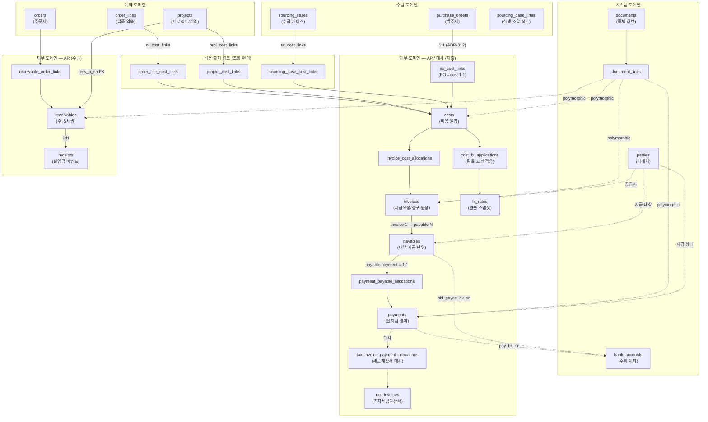

# 재무 데이터 흐름 상세 (Finance Data Flow)

> **문서 버전**: v2.0 (시뮬레이션 기준 갱신 — index.html / recon.html 반영)
> **참조**: index.html, recon.html, erp_finance_schema.sql, ADR-002, ADR-009, ADR-011, ADR-012
> **최종 갱신일**: 2026-04-09

---

## 1. 핵심 엔티티 관계도



---

## 2. AP (지출) 흐름 상세

### 2.1 비용 인식 흐름

```
PO 확정
  │
  ▼
costs 생성
  - ct_type: PRODUCT / SHIPPING / CUSTOMS / SERVICE / OTHER
  - ct_pt_sn: 공급 업체
  - ct_amount, ct_ccy

  │ (해외 비용인 경우)
  ▼
cost_fx_applications 생성
  - fx_sn: 적용 환율 스냅샷
  - cfxa_policy_code: PO_DATE / PAYMENT_DATE 등

  │
  ▼
po_cost_links 생성 (PO ↔ cost 1:1 연결)
  - 조회 편의용, 회계 기준은 cost_allocations
```

### 2.2 지급 요청 흐름

```
거래처 청구서(거래명세서/Invoice PDF) 수신
  │
  ▼
invoices 등록
  - inv_invoice_type: STATEMENT / INVOICE / OTHER
  - inv_total_amount: 지급요청 총액
  - documents + document_links로 PDF 연결

  │
  ▼
invoice_cost_allocations 연결
  - 이 지급요청이 어떤 cost를 근거로 하는지 매핑
  - N:M 구조 (invoice 1:cost N, cost 1:invoice N 허용)

  │
  ▼
payables 생성 (내부 지급 단위, 지급 승인의 핵심)
  - pbl_inv_sn: 출처 Invoice
  - pbl_payable_status: CREATED → APPROVED → PAID
  - pbl_due_at: 지급 기한
  - **불변식**: Invoice가 아닌 Payable이 지급 실행(재무 집행) 및 상위 승인의 최소 단위임
```

### 2.3 마이너스 Cost (상계/Offset) 처리 흐름 *(v2.0 신규)*

```
costs.amount < 0 인 비용 존재
  │
  ▼
지급요청관리(AP) 또는 정기결제 관리 상세 패널에서
[상계 처리 내역 불러오기] 버튼 클릭
  │
  ▼
해당 거래처(pt_name)의 미할당 마이너스 Cost 목록 불러오기
(payable_cost_allocations에 미연결 + costs.amount < 0)
  │
  ▼
재무담당자가 항목 적용 → payable_cost_allocations에 추가
  - pbl_total_amount 즉시 차감 반영
  - 항목 옆 [×] 버튼으로 개별 제거 가능 → pbl_total_amount 복원
```

> **적용 조건**: 결제할 금액(`net`)이 0원 초과인 경우에만 상계가 의미 있음.
> 상계 적용 후 net이 0원 이하가 되는 경우 UI에서 경고 처리 권장.

### 2.4 지급 실행 및 지급 내역(History) 흐름

```
payables APPROVED 상태 확인
  │
  ▼
[일반 AP] 단건 또는 다건 지급 실행 / [정기결제] 일괄 지급 실행
  │
  ▼
payments 생성 (또는 카드/현금 선결제 건 유입)
  - pay_method: TRANSFER (계좌이체) / CARD (법인카드) / CASH (현금)
  - pay_bk_sn: 실제 이체에 사용된 수취 계좌 (이체인 경우)
  - pay_status: PAID

  │
  ▼
지급 내역 관리 (index.html?menu=payments)
  - [Read-Only] 재무팀은 결제 수단별 필터링을 통해 기지급 내역을 상시 모니터링
  - 사후 증빙(영수증 PDF 등) 연결 상태 확인 및 다운로드 전용
  - [+ 정산조정(환수 등) 발의] 버튼으로 정산조정 모달 즉시 발의 가능
```

> **[예외 흐름] 카드 및 현금 결제 직행 건 (현장 구매, 1회성 용달 등)**
> - 현업(구매 등) 담당자가 법인카드 또는 현금으로 선결제한 건은 `payables` 결재/승인 큐를 통과하지 않습니다.
> - 즉시 `payments` 레코드(상태: PAID)로 생성되어 지급내역 리스트에 꽂히게 됩니다.
> - **재무담당자는 지급내역 리스트에서 별도 수정 없이 Read-Only로만 확인**합니다.

### 2.4 세금계산서 대사 흐름

```
홈택스 API / 수동 입력으로 tax_invoices 등록
  - ti_approval_no: 국세청 승인번호
  - ti_recon_status: UNMATCHED (초기값)

  │
  ▼
tax_invoice_payment_allocations 연결
  - 세금계산서 ↔ payments 매칭 (부분 매칭 허용)
  - tipa_amount: 이번 매칭 금액

  │
  ▼
ti_recon_status 업데이트
  - UNMATCHED → PARTIAL → MATCHED

※ 대사 혹은 지급 완료 내역 조회 과정에서 부분 차액이나 예외(추가금/환수) 발생 시, 화면 이탈 없이 프론트엔드 전용 모달을 호출하여 **정산조정(settlement_adjustments) 파이프라인**을 즉시 발의하며, 발생한 데이터는 전역 스토리지 및 DB 연동을 통해 타 모듈(정산조정 리스트)에 실시간으로 동기화된다. (주요 진입점: 지급내역 상세, 세금계산서 대사 상세)
※ **현재 범위 내 정산조정 상태**: `대기` (생성) → `진행중` (결재요청) → `승인완료` (CEO 승인) / `반려`
```

---

## 3. AR (수금) 흐름 상세

```
Project 계약 체결
  │
  ▼
receivables 생성
  - recv_p_sn: 프로젝트 귀속
  - recv_type: CUSTOMER_INVOICE / PROGRESS_BILLING / FINAL_BILLING
  - recv_status: DRAFT → ISSUED → PARTIALLY_PAID → PAID

  │
  ▼
receivable_order_links 연결
  - order(주문서) 1개는 receivable 하나에만 포함 (UNIQUE 제약)

  │
  ▼
(입금 발생 시) receipts 생성
  - rcp_recv_sn: 연결 receivable
  - rcp_status: PENDING → CONFIRMED
  - rcp_amount: 실제 수금 금액
```

---

## 4. 상태 전이 정의

### 4.1 payables 상태 전이

```
```
CREATED(일반 요청) ──► APPROVED(대표 승인) ──► PAID(재무 지급 실행)
    │                       │
    ▼                       ▼
REJECTED(대표 반려/취소) ON_HOLD ──► APPROVED(대표 재승인)
```

| 상태 | 의미 | 가능 액션 | 통제 권한 |
|---|---|---|---|
| `CREATED` | 지급 단위 생성됨 (요청됨) | 승인 요청 / 취소 | 기안자 / 재무담당자 |
| `APPROVED` | **대표 승인 완료** (지급 실행 가능) | 지급 실행 / 보류 | **대표 승인 필수** |
| `PAID` | 지급 완료 | (지급내역으로 이동) | 재무담당자 |
| `REJECTED` | 오류 무효화 또는 **대표 반려** | 없음 (최종) | 대표 반려 |

> **지급 상태 관리**: `PAID` 상태로 전환된 건은 지급 관리(AP) 리스트에서 자동으로 제외되어 '지급내역 관리'로 이동합니다. 이에 따라 원장 관리 화면의 필터에는 `CREATED`와 `APPROVED` 상태만 노출됩니다.

### 4.1-B 정기결제 자동 격리 로직 *(v2.0 신규)*

```
거래처(pt_name)가 periodic_vendors 배열에 등록되고
payable.pbl_payable_status === 'APPROVED'인 경우
  │
  ▼
일반 AP 리스트(filteredApList)에서 자동 제외
  │
  ▼
정기결제 관리 탭(periodic)의 selectedPeriodicPayables에만 표출
```

- CREATED 상태 payable은 정기결제 등록 여부와 무관하게 일반 AP 리스트에 표시됨 (승인 대기 건은 공통 관리)
- APPROVED로 전환되는 순간 해당 거래처가 periodic_vendors에 있으면 정기결제 탭으로 격리

### 4.2 미지급 관리 (Unpaid Monitoring) 로직
지급되지 않은 모든 `payables`의 잔액(`pbl_total_amount - paid_amount`)을 실시간 집계하여 거래처/프로젝트별 리스크를 산출한다.
- **리스크 경보**: 잔액 합계 2천만원 초과 시 UI상에서 rose 색상 강조.
- **데이터 소스**: 미지급 관리 페이지의 발주서 기반 건 — `미지급 잔액 = 계약/발주 총액 - 기지급 대금`
- **표시 제외**: 미지급 잔액이 0원인 건은 리스트에서 제외 (완납 건)

### 4.2 receivables 상태 전이

```
DRAFT ──► ISSUED ──► PARTIALLY_PAID ──► PAID
                              │
                              ▼
                           CLOSED (회계 마감)
DRAFT/ISSUED ──► REJECTED
```

| 상태 | 조건 |
|---|---|
| `DRAFT` | 초안 (포함 라인/금액 변동 가능) |
| `ISSUED` | 발행 확정 (외부 청구/요청 준하는 상태) |
| `PARTIALLY_PAID` | SUM(receipts) < recv_amount_total |
| `PAID` | SUM(receipts) == recv_amount_total |
| `REJECTED` | 정산 단위 무효 |
| `CLOSED` | 회계 마감 등 운영상 종료 |

### 4.3 tax_invoices 대사 상태

| `UNMATCHED` | 아직 매칭된 payment 없음 (불일치) |
| `PARTIAL` | 일부 payment 매칭 (부분일치) |
| `MATCHED` | 전액 매칭 완료 (대사완료) |

---

## 5. 시뮬레이션 범위 안내 (Phase 1)

본 문서의 **AR (수금/입금)** 관련 엔티티(`.receivables`, `.receipts`) 및 흐름은 전체 시스템의 정합성을 위한 아키텍처 설계본입니다. 현재 제공되는 **지급/대사 시뮬레이션(index.html, recon.html)** 범위에는 AP(지출) 및 대사/정산조정 기능만 포함되어 있으며, AR 기능은 후속 단계에서 구현됩니다.

## 5. 비용 출처 링크 구조 (참조용)

한 cost(ct_sn)는 아래 링크 테이블 중 **단 하나에만** 등장해야 한다 (운영 원칙).

| 링크 테이블 | 출처 엔티티 | 주요 사용 케이스 |
|---|---|---|
| `po_cost_links` | `purchase_orders` | PO 기반 구매 비용 (1:1 정책) |
| `project_cost_links` | `projects` | 프로젝트 직접 비용 (수수료 등) |
| `order_line_cost_links` | `order_lines` | 납품 항목 직접 귀속 비용 (검사비 등) |
| `sourcing_case_cost_links` | `sourcing_cases` | 수급 케이스 비용 (통관/운송 등) |
| `shipment_cost_links` | `shipments` | 배송 단위 비용 |

> **회계/정산 기준**: 위 링크는 조회 편의용. 실제 원가 귀속 기준은 `cost_allocations`.

---

## 6. 증빙 연결 기준표

| 업무 단계 | 필수 증빙 | documents 연결 target_type |
|---|---|---|
| 비용 인식 | 거래명세서, 납품 확인증 | `COST` |
| 지급 요청 | 청구서 PDF, 거래명세서 | `INVOICE` |
| 지급 실행 | 이체 영수증, 송금확인증 | `PAYMENT` |
| 세금계산서 | 전자세금계산서 XML/PDF | `TAX_INVOICE` |
| 수금 | 입금 확인증, 정산서 | `RECEIVABLE` / `RECEIPT` |

---

## 7. 주요 정합성 규칙

| 규칙 | 검증 방식 |
|---|---|
| PO 1건 = cost 1건 | `po_cost_links` UNIQUE KEY (po_sn), UNIQUE KEY (ct_sn) |
| cost 1건 = 출처 링크 1개 | 서비스 레벨 검증 (전역적 유니크 DB 강제 불가) |
| order → receivable 최대 1회 포함 | `receivable_order_links.rol_o_sn` UNIQUE |
| payable:payment = 1:1 (운영 정책) | 서비스 레벨 검증 |
| 수금 초과 원칙적 금지 | SUM(receipts) ≤ recv_amount_total |
