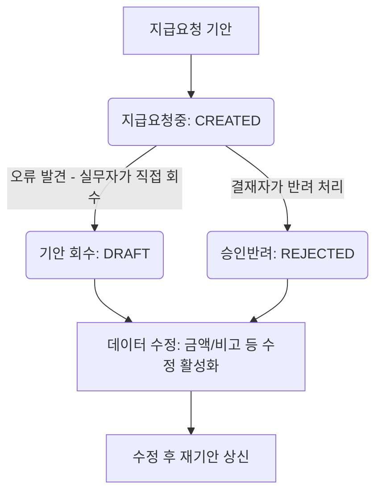
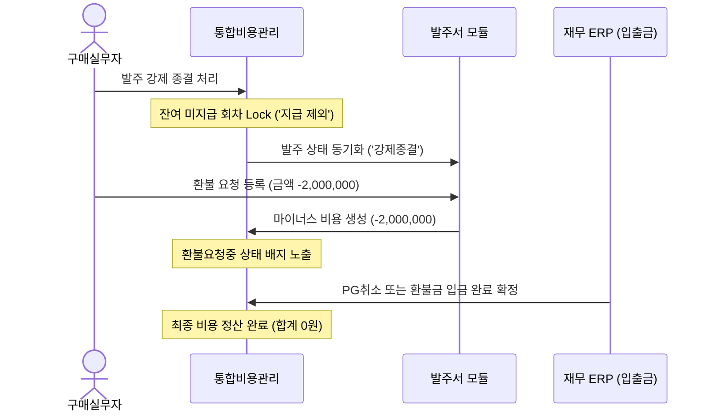

# 지급요청 회수 및 발주 강제종결/환불 프로세스 기획안

이 기획안은 통합비용관리 및 발주 시스템 내에서 발생할 수 있는 **지급요청 기안 오류(상황 1)**와 **일부 지급 완료 후 발주 취소(상황 2)**에 대응하기 위한 데이터 모델, 워크플로우 및 UI/UX 가이드라인을 제공합니다. 

두 상황 모두 단순 "취소"라는 용어로 정의될 경우 데이터 담당자와 실무자에게 심각한 혼선을 초래하므로, 명확하게 구분된 용어 체계와 데이터 상태 전이 규칙을 제안합니다.

---

## 1. 용어 체계 정립 (데이터 혼선 방지)

두 취소 프로세스를 물리적/논리적으로 명확하게 구분하기 위해 다음과 같이 용어를 표준화합니다.

| 분류 | 상황 1: 지급요청 오류 발생 | 상황 2: 기지급 후 발주 취소 |
| :--- | :--- | :--- |
| **권장 용어 (UI)** | **기안 회수 (Recall / Rollback)** | **발주 종결 및 지급중단 (Terminate PO)** |
| **비즈니스 목적** | 아직 이체되지 않은 결재 요청을 철회하고 수정/재기안함 | 발주 계약 자체가 무효화되어 미래의 이체를 차단함 |
| **적용 범위** | 특정 지급 회차(Installment) 개별 건 | 발주비용 건 전체(Cost Master) 및 잔여 회차 일괄 |
| **결재 상태** | 승인요청중 (`CREATED`) $\rightarrow$ 회수 (`DRAFT`) | 지급완료(`PROCESSED`) & 미지급 회차 잠금(`EXCLUDED`) |
| **돈의 흐름** | 자금 이동 없음 (실제 인출 전) | 이미 지출된 자금 회수 필요 (**환불 연동**) |

---

## 2. 상황 1: 지급요청 중 기안 오류 및 취소 (기안 회수)

> **시나리오**: 담당자가 2회차 중도금 3,000,000원을 요청해야 하는데 실수로 30,000,000원으로 지급요청 기안을 올린 경우.

### 2.1 사용자 안 (행 비활성화 및 새 행 추가) 검토
* **사용자 의견**: 기존 기안행을 비활성화(취소)하고 행추가를 통해 새 기안을 진행함.
* **단점 및 문제점**:
  1. **데이터 중복 및 오염**: 잘못 기안한 더미 데이터가 테이블에 영구히 남아, 나중에 정산 합계나 지급 이력을 조회할 때 혼선을 유발합니다.
  2. **잔액 계산 꼬임**: 분할 지급(계약금/중도금/잔금) 밸런싱 로직(`balanceInstallments`)에서 취소된 비활성 행의 금액 처리가 애매해져 최종 합계 검증이 복잡해집니다.
  3. **실무 피로도**: 한 발주건 아래에 5개 이상의 취소 행과 실제 기안 행이 뒤섞여 시각적 가독성이 떨어집니다.

### 2.2 권장 설계안: "회수 후 수정 (Recall & Edit)"
기결재 승인(또는 이체 실행) 전 단계에서는 기존 데이터를 삭제하거나 수정하여 다시 쓸 수 있도록 **"회수"** 개념을 도입하는 것이 가장 표준적이고 깔끔합니다.



#### 시스템 데이터 전이
1. **상태값 롤백**: 
   * `payable_status`를 `CREATED` $\rightarrow$ `DRAFT` (혹은 `RECALLED` 후 즉시 기안대기로 원복)로 변경합니다.
2. **수정 제한 해제**: 
   * 회수된 행의 Input Lock을 해제하여 실무자가 금액, 날짜, 계좌 정보 등을 수정할 수 있게 합니다.
3. **이력 로그 기록**: 
   * `audit_logs` 테이블에 `[지급요청 회수: 중간관리자가 2회차 지급요청을 회수함]` 로그를 남깁니다.

---

## 3. 상황 2: 일부 지급 완료 후 발주 취소 (발주 종결 및 환불)

> **시나리오**: 1회차 계약금 2,000,000원은 이미 송금 완료(지급완료)되었으나, 공급업체의 계약 위반이나 프로젝트 중단으로 인해 발주 전체를 취소하고 계약금을 돌려받아야 하는 경우.

### 3.1 프로세스 동기화 (통합비용관리 $\leftrightarrow$ 발주 모듈)
이미 지급 완료된 이력이 존재하므로 단순 "삭제"나 "기안 취소"로 처리할 수 없습니다. **"발주 종결"**과 **"환불 추적"**의 투 트랙으로 움직여야 합니다.



### 3.2 상세 처리 단계

#### Step 1. 앞으로 나갈 돈 잠금 (지급 중단)
* **액션**: 통합비용관리 상세 화면에서 **[발주 종결]** 실행.
* **데이터 변화**:
  * 미지급 상태인 차기 회차들(기안대기, 작성중)의 상태를 `EXCLUDED` (지급 제외)로 강제 변경하고 수정/선택이 불가능하도록 비활성화합니다.
  * 해당 발주(Cost Master Header)의 마스터 상태(`ct_status`)를 `TERMINATED` (종결)로 업서트하여 추가적인 행 추가를 금지합니다.

#### Step 2. 이미 나간 돈 돌려받기 (환불 요청)
* **액션**: 발주서 단계에서 **[환불 요청]**을 등록하면, 통합비용관리 모듈로 마이너스(-)payable 레코드가 자동 발행됩니다.
* **데이터 변화**:
  * `ct_status = 'REFUND'`, `amount = -2,000,000`인 마이너스 비용 행이 새로 생성됩니다.
  * 해당 환불 건에 대해 재무 ERP에서 입금 확인이 완료되면 `pay_status = 'PROCESSED'`(지급완료)로 처리되어, 해당 발주건의 누적 실 지출 합계가 최종적으로 `0원`으로 맞춰지게 됩니다.

---

## 4. 데이터 담당자를 위한 DB 스키마 설계안

데이터 담당자가 상태값을 정의할 때 헷갈리지 않도록 명확한 DB 도메인 코드를 제안합니다.

### 4.1 `cost_master` (비용 마스터 테이블)
발주 또는 부대비용의 전체 라이프사이클을 결정합니다.

```sql
ALTER TABLE cost_master ADD COLUMN ct_status VARCHAR(20) DEFAULT 'CREATE';
-- 코드가 가질 수 있는 값:
-- 'CREATE'     : 비용 등록 및 정상 진행 중
-- 'TERMINATED' : 발주 강제종결 (미지급분 지급 중단 상태)
-- 'REFUND'     : 환불 진행 중 (마이너스 금액 발생 상태)
```

### 4.2 `payables` (지급요청 테이블)
각 회차별 지급 요청 단계의 상태를 다룹니다.

```sql
ALTER TABLE payables ADD COLUMN pbl_status VARCHAR(20) DEFAULT 'DRAFT';
-- 코드가 가질 수 있는 값:
-- 'DRAFT'     : 기안대기 (수정 가능)
-- 'CREATED'   : 지급요청중 (승인 결재선 대기, 수정 불가능)
-- 'RECALLED'  : 기안자가 결재 중 회수한 상태 (다시 DRAFT로 전환하기 전 아카이브용 상태)
-- 'APPROVED'  : CEO 승인 완료 (지급대기 상태)
-- 'REJECTED'  : CEO 승인 반려 (수정 후 재기안 필요)
-- 'PROCESSED' : 재무팀 이체/카드 승인 완료 (지급완료)
-- 'EXCLUDED'  : 발주 종결로 인해 지급 대상에서 영구 제외됨 (Lock)
```

---

## 5. UI/UX 화면 구성 예시

실무자가 화면에서 실수하지 않도록 UI 장치를 다음과 같이 배치합니다.

1. **[기안 회수] 버튼 노출 조건**:
   * 회차 상태가 `지급요청중`일 때만 기안자(실무자) 화면 하단에 `[요청 회수]` 버튼이 활성화됩니다.
   * 클릭 시: *"아직 결재가 진행 중인 지급 요청입니다. 회수하여 수정하시겠습니까?"* 안내창을 띄우고 회수 처리합니다.
2. **[발주 종결 및 지급중단] 기능**:
   * 발주 상세 페이지의 최하단 또는 우측 설정 영역에 배치.
   * 클릭 시: *"발주를 종결하면 아직 지급되지 않은 모든 회차(중도금, 잔금 등)의 기안이 불가능하게 됩니다. 진행하시겠습니까?"* 경고 팝업 노출.
   * 처리 완료 시, 해당 목록의 모든 잔여 인풋 필드가 어둡게 잠기고 배지 모양이 `지급제외`로 변경됩니다.
3. **환불 마이너스 행 가시화**:
   * 환불 건은 메인 그리드 및 상세 내역에 붉은색 계통의 마이너스 금액(예: `-2,000,000원`)으로 렌더링되며 `환불처리` 배지가 표시되어 한눈에 직관적인 구분감을 줍니다.
