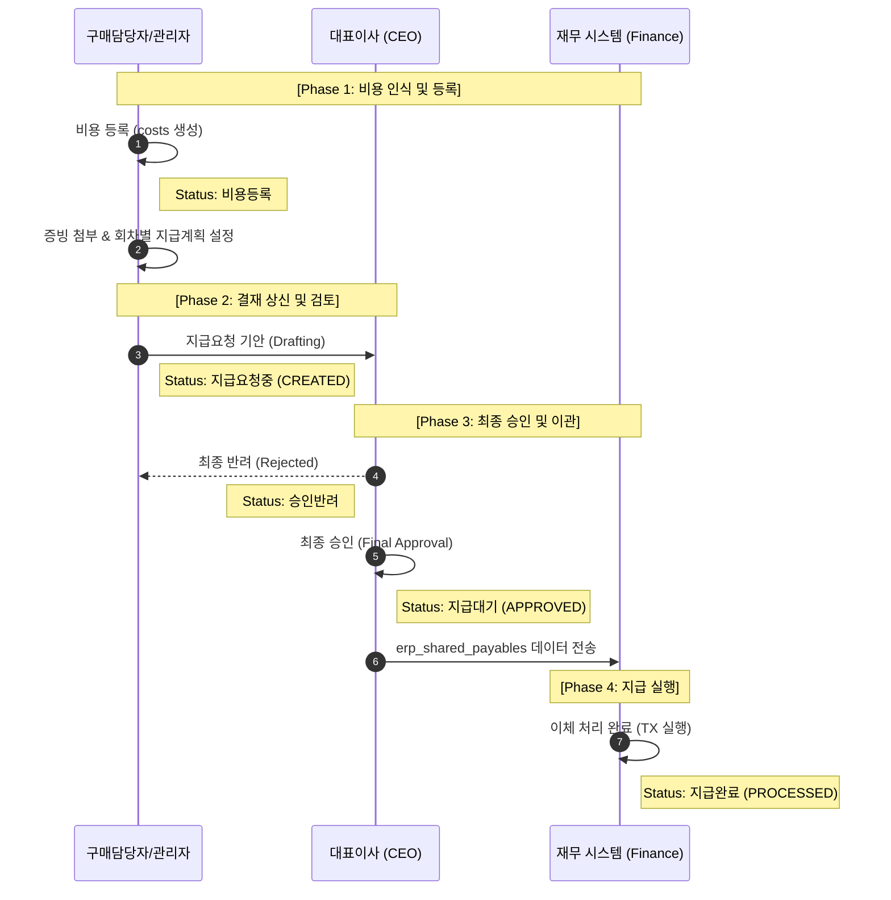

# 통합 비용 관리 — 진행상태 정의 및 상태 전이 명세
# Proc Cost Status Specification

> **대상 화면**: `docs_finance/docs_proc/pro.html` (통합 비용 관리)
> **관련 정책 문서**: `SPEC_proc_simulation.md`
> **최종 갱신일**: 2026-05-14

---

## 1. 역할 정의 (Roles)

시뮬레이션(`pro.html`)은 구매 파트의 업무를 크게 **집행 권한(Purchase)**과 **승인 권한(CEO)**으로 구분하며, 집행 권한 내에서 담당자와 관리자의 **조회 범위**를 차별화합니다.

| 역할명 | 시뮬레이션 내 구현 | 행위 로직 (Logic) | 데이터 가시성 (Visibility) |
|---|---|---|---|
| **구매담당자** (Staff) | `팀원1`, `팀원2` | **동일**: 비용 등록, 증빙 업로드, 지급 요청 기안. | **본인 전용**: 본인이 등록한 항목만 조회 가능. (타인 선택 버튼 비노출) |
| **중간관리자** (Manager) | `중간관리자` (본인) | **동일**: 비용 등록, 증빙 업로드, 지급 요청 기안. | **팀 전체**: 본인 및 모든 팀원의 항목 조회 가능. (담당자 선택 필터 노출) |
| **대표이사** (CEO) | `CEO` | 최종 검토 및 승인/반려 처리. | **전사**: 모든 담당자의 상신 건 조회 가능. |

---

## 2. 진행상태 정의 (Status Values)

`pro.html`의 메인 그리드 및 상세 패널에서 사용하는 6단계 정본 상태입니다.

| 상태명 (UI 표시) | 색상 (Badge) | 정본 DB 상태 | 설명 |
|---|---|---|---|
| **비용등록** | ⚪ Slate | `DRAFT` (Initial) | 비용 원장(`costs`)만 생성된 상태. 아직 지급 요청 프로세스가 시작되지 않음. |
| **지급요청중** | 🔵 Indigo | `CREATED` | 결재를 상신하여 CEO 결재 큐에 진입한 상태. (`payables` 생성 시점) |
| **지급대기** | 🟡 Amber | `APPROVED` | CEO 최종 승인 완료. 재무 담당자의 이체 집행을 기다리는 상태. |
| **승인반려** | 🔴 Rose | `REJECTED` | CEO가 반려한 상태. 담당자/관리자가 사유 확인 후 수정 및 재기안 가능. |
| **지급완료** | 🟢 Emerald | `PROCESSED` | 재무 담당자가 이체를 완료한 상태. (`payments` 생성됨) |
| **환불처리** | 🟣 Purple | `REFUND` | `amount < 0`인 마이너스 비용 항목에 대한 특수 처리 상태. |

---

## 3. 역할별 액션 및 상태 전이 매트릭스

### 3.1 구매 집행 그룹 (구매담당자 & 중간관리자) — `PURCHASE` 뷰

**※ 두 역할의 행위 로직은 완전히 동일하며, 조회 가능한 데이터 범위만 다릅니다.**

| 현재 상태 | 액션 주체 | 액션 버튼 | 결과 상태 (To) | 액션 조건 및 제약사항 |
|---|---|---|---|---|
| (시작) | 담당자/관리자 | **부대비용 등록** | 비용등록 | `costs` 레코드 생성. 분할 지급(Installment) 초기 세팅. |
| 비용등록 | 담당자/관리자 | **승인 요청 기안하기** | 지급요청중 | `payables` 레코드 생성 (`pbl_status = 'CREATED'`). |
| 승인반려 | 담당자/관리자 | **승인 요청 기안하기** | 지급요청중 | 반려 사유 보완 후 재상신. |
| 지급요청중 | — | (수정 잠금) | — | CEO 검토 중인 상태로 데이터 수정 불가. |

### 3.2 대표이사 (CEO) — `CEO` 뷰

| 현재 상태 | 액션 버튼 | 결과 상태 (To) | 액션 조건 및 제약사항 |
|---|---|---|---|
| 지급요청중 | **최종 승인하기** | 지급대기 | 클릭 시 `pbl_status`를 `APPROVED`로 변경. |
| 지급요청중 | **반려하기** | 승인반려 | **반려 의견(`ceoComment`) 입력 필수.** |
| 지급요청중 (카드/환불) | **내용 확인 완료** | 지급대기 | 이미 지출된 건(카드) 또는 마이너스 건에 대한 확인 처리. |

---

## 4. 전체 상태 전이 다이어그램 (Sequence View)

---

## 5. 특이 케이스 처리 (Exception Handling)

1.  **법인카드/현금 선결제 건**: 
    -   이미 지불이 완료된 건으로, `payable` 프로세스 없이 `costs`에 바로 기록됨. 
    -   CEO는 '승인' 대신 **'내용 확인 완료'** 버튼을 통해 사후 보고를 확인함.
2.  **환불 건 (`amount < 0`)**: 
    -   진행상태 배지에 **환불처리**가 우선 표시됨. 
    -   카드 환불은 PG사 취소 연동, 계좌 환불은 정산조정관리(Recon) 연동 대상으로 분류됨.
3.  **반려 후 재기안**: 
    -   반려된 건은 리스트에서 🔴 Rose 색상으로 강조되며, 담당자가 상세 패널에서 **[재기안]** 처리 시 다시 **지급요청중** 상태로 전이됨.
