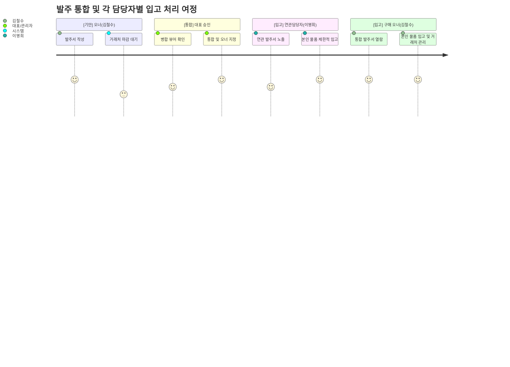

# 발주서 병합 및 입출고 프로세스 — 와이어프레임 명세서

> **대상 시스템:** 공공조달 ERP (구매/물류 파트)  
> **관련 문서:** `erp_purchase_design_summary.md` (데이터/플로우 기획안)  
> **주요 시나리오:** 발주 오너(김철수) 기안 → 통합 병합(머지) → 오너(김철수) 및 셋방 연관담당자(이영희)의 입출고(재고 수령) 처리 대시보드 화면

---

## 1. 개요 및 화면 흐름도 (Screen Flow)



---

## 2. 화면 명세서 세부 내역

### [화면 01] 발주 기안 화면 (구매담당자 김철수)

**화면 목적:** 특정 거래처 벤더를 선택하고, 물품 라인을 작성하여 상신 큐에 등록합니다.

**와이어프레임 구조:**
```text
[ 헤더: 신규 발주서 생성 ]
-------------------------------------------------------------------------
[ 정보 입력 ]
▶ 소속 프로젝트 : [ PRJ-2026-001 (공공기관 소프트웨어구축) ]
▶ 대상 거래처(Party) : [ 서산베어링 (B2B 직거래 ▼) ]
   💡 안내: 해당 거래처는 [매주 화요일] 마감 풀(Pool) 적용 대상입니다.
   💡 현재 동일 벤더를 향한 타 부서 대기 발주: 2건 진행 중

[ 발주 물품 라인 (po_lines) ]
| No | 품목       | 요구 수량 | 외형 단가 | 합계 |
| 1  | 볼펜 세트  | 50 Box    | 8,500원   | 425,000원 |
[+ 라인 추가]

[ 액션 및 상신 ]
[ Toggle ] 긴급 상신 (예외 사유 입력 시 시스템 대기열 풀 우회) 
   └ [ 긴급 사유 입력창 (비활성화 상태) ]
                                      [ 거래처 큐 전송 (상신) ] [ 임시 저장 ]
-------------------------------------------------------------------------
```

**작동 방식 및 데이터 바인딩:**
* 거래처 선택 시 `parties.pt_order_deadline_day` 값이 존재하면 마감 알림 표시 및 대기열 로직 발동. 오픈마켓 등의 경우 즉시 상신 문구 반환.

---

### [화면 02] 대표자 발주 통합 검토 뷰어 (승인 및 머지)

**화면 목적:** 동일 B2B 거래처 건에 대해 조각난 여러 부서의 발주서를 하나로 통합(Merge)하여 협상력과 운송비를 통제합니다.

**와이어프레임 구조:**
```text
[ 헤더: 발주서 병합 결재 뷰어 (대상 벤더: 서산베어링) ]
-------------------------------------------------------------------------
💡 시스템 분석: "서산베어링" 향 발주 2건 감지. [병합하여 발주 시 혜택 가능]

[ O 통합 오너 지정 ] PO_RQ_101 (선택됨)    VS  [ O 통합 오너 지정 ] PO_RQ_102
[ 기안자 ] 김철수 (기본권)                       [ 기안자 ] 이영희
[ 부서명 ] 관공서 조달 1팀                       [ 부서명 ] 기업 조달 2팀
[ 총금액/물량 ] 425,000원 (총 50개)              [ 총금액/물량 ] 180,000원 (총 15개)

-------------------------------------------------------------------------
[ 통합 뷰 미리보기 (po_lines 가상 프리뷰) ]
| 구분 (조인 원담당자) | 품목       | 수량 | 단가    | 금액 | 배송/결제 귀속 |
|----------------------|------------|------|---------|------|----------------|
| [본인] 김철수          | 볼펜 세트  | 50   | 8,500   | ...  | -> 헤더(PO_101) 유지
| [조인] 이영희          | 스테이플러 | 15   | 12,000  | ...  | -> FK 이관 발생

[ 하단 액션 ]
[ 각각 개별 승인 ]    [ ⚡ 선택된 오너(김철수) 명의로 일괄 병합 승인 ]    [ 통합 반려 ]
-------------------------------------------------------------------------
```

**작동 방식 및 데이터 바인딩:**
* 일괄 병합 승인 클릭 시 트랜잭션 발동. 이영희 측 발주 라인의 헤더 FK(`po_sn`)를 김철수의 통합 PO 번호로 강제로 이관합니다. 단, 각 라인의 Sourcing 관계는 유지됩니다.

---

### [화면 03] 연관 발주서 입출고 대시보드 (원담당자: 이영희 뷰 화면)

**화면 목적:** 발주서(헤더) 권한을 잃고 하나로 병합당한 담당자(이영희)가 조인을 통해 **자신이 신청한 물품 라인만을** 필터링하여 확인하고 "재고 수령 이력"을 남기는 화면입니다.

**와이어프레임 구조:**
```text
[ 헤더: 연관(병합된) PO 상세 뷰 - 읽기 전용 컨트롤 ]
[ 🏷️ 통합 발주서 ] 번호: PO-FINAL-999 / 최종 오너: 김철수
💡 안내: 본 발주서는 마감일 트랜잭션에 의해 타 부서와 병합 발송되었습니다. (회원님의 품목 1건 포함)

-------------------------------------------------------------------------
[ 내 물품 입고/검수 리스트 (DB 조인: 이영희 소속 라인만 표출) ]
| 품목 (po_lines) | 기안수량 | 현재 재고상태 (`iu_status`) | 수령완료 물량 | 액션               |
|-----------------|----------|-----------------------------|-------------|--------------------|
| 스테이플러      | 15 개    | 대기 중 (PENDING)             | 0 개        | [ 📦 입고 작업 생성 ] |

-------------------------------------------------------------------------
[ 🔒 타겟 오너(김철수) 및 전체 발주내역 보기 (권한 제한) ] (클릭 시 펼치기)
-------------------------------------------------------------------------

[ 권한 제한 정책 안내 ] 
* 대금 결제 시스템 상신 및 거래처와의 납기일정 조율 주체는 오너(김철수)만 가능합니다.
-------------------------------------------------------------------------
```

**UX 플로우:**
1. 이영희는 오로지 권한이 유지된 자신의 `po_lines` 항목에 놓인 `[ 📦 입고 작업 생성 ]` 버튼만 클릭 가능합니다.
2. 타 담당자의 물품 납품 현황 변경에는 개입할 수 없습니다.

---

### [화면 04] 종합 발주서 입출고 대시보드 (통합 오너: 김철수 뷰 화면)

**화면 목적:** 통합 PO의 새로운 오너로서 전체 물품의 결제를 통제하지만, 바코드 스캔 같은 실물 입고(`inventory_operations`) 작업 이력 생성은 교차 간섭 방지를 위해 본인 소속 물품에만 허용됩니다.

**와이어프레임 구조:**
```text
[ 헤더: 종합 발주서 상세 내역 및 실물 재고 관리 ]
[ 👑 대표 오너 권한 획득 PO ] 번호: PO-FINAL-999 (대상벤더: 서산베어링)

-------------------------------------------------------------------------
[ 거래처 수급 관리 툴 (오너 단독 권한 활성화) ]
[ 📞 벤더 컨택 기록 및 납기일 조율 ] [ 💳 ERP 인보이스 및 결제대금 지불 상신 ]

-------------------------------------------------------------------------
[ 발주 라인 검수 및 수령 리스트 (전부 노출) ]
| 인디케이터 | 귀속(Origin) | 품목       | 수량 | 재고 상태 | 누적 수령 | 액션 |
|----------|--------------|------------|------|-----------|-----------|------|
| 🟢 내 물품 | 김철수(나)   | 볼펜 세트  | 50   | 입고/보유 | 50 (완료) | [ 📦 입고 작업 (완료/비활성) ]
| 🟣 셋방 라인| 이영희      | 스테이플러 | 15   | 부분보유  | 5 (미완결) | [ 🔒 타 담당자 권한 잠금 ]

💡 종합 안내: 보라색 마커(🟣)는 머지 트랜잭션에 의해 편입된 이영희 님의 자산입니다. 
이영희 책임자가 직접 실물을 검수하고 시스템에서 입고 트랜잭션을 누적 개시합니다.
-------------------------------------------------------------------------
```

**UX 플로우:**
* 김철수는 전체 발주의 송장(Invoice/Payable) 처리를 일괄 수행하지만, 개별 재고 물류 수령 원장은 실물 소유 주체(이영희, 김철수 각각)가 분리하여 작업합니다. 이를 억지로 김철수가 통합 수행하게 강제하지 않습니다.

---

### [화면 05] 공통 입고(검수) 트랜잭션 추가 팝업 (재고 원장 기록)

**화면 목적:** 단순 필드 값을 마음대로 바꾸는 것이 아니라, ERP 규범에 따라 정상적으로 `inventory_operations` 헤더(RECEIPT 타입)와 `inventory_operation_lines (방향: IN)` 레코드를 쌓아 올리기 위한 공용 컴포넌트입니다.

**와이어프레임 구조:**
```text
[ 팝업: 물품 실물 수령 및 재고 이력 트랜잭션 스레드 적재 ]
대상 물품: [ 스테이플러 (이영희 귀속) ]

당초 전체 발주 요구 수량 : 15 개
현재까지 수령 통과한 누적 수량 : 5 개
====================================
금번 새로 수령할 입고분(RECEIPT) 갯수 : [ 10 ] 개  (input)

[ 바코드 / 시리얼 식별 비고 (inventory_units 메모용) ]
[____________________________________________________]

[ 검수 작업자 노트 (박스 파손/특이사항/하자 등) ]
[____________________________________________________]

* ⚠️주의: 생성된 입고 작업 기록은 ERP 재고 통계 원장에 귀속(Posted)되며, 
  처리 완료 즉시 연관된 발주 오너(김철수)에게 자동 알람이 푸시 발송됩니다.

                                     [ 뒤로가기 ]  [ ✔ 입고 작업 트랜잭션 발동 확정 ]
```

**데이터 생성 로직 (Backend 규격):**
1. 백엔드에서 `inventory_operations` 테이블에 `io_type = 'RECEIPT', io_status = 'POSTED'` 데이터 추가.
2. `inventory_operation_lines` 하위 테이블에 `iol_qty = (입력된 수량), iol_direction = 'IN'` 객체 추가.
3. 처리 성공 시 해당 팝업 종료 및 UI 리프레시를 통해 총 잔여 갯수를 갱신 표출.
